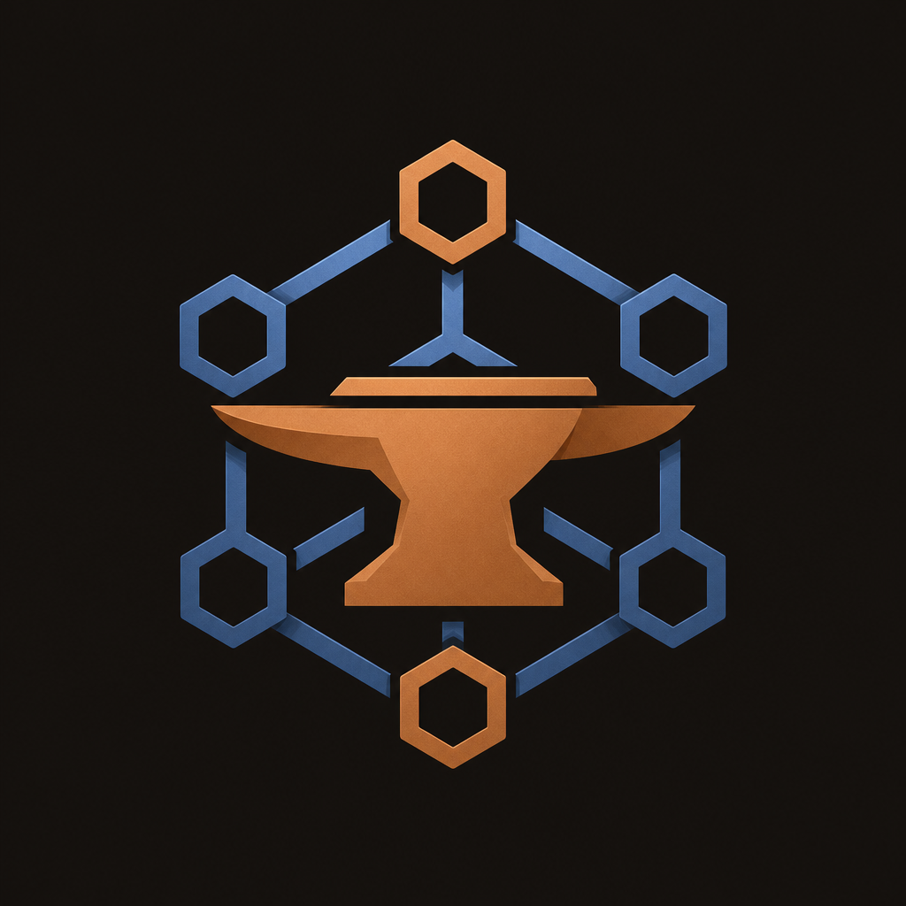

<h1 align="center">MexoForge</h1>

<strong>Forging production AI systems</strong>

<em>AI infrastructure forge · Berlin, Germany</em>

  
  
  

  
  
  
  

## About
**MexoForge** engineers production AI infrastructure — agent runtimes, retrieval-augmented pipelines, evaluation and safety harnesses, inference gateways, and MLOps stacks that take LLM products from prototype to production. A focused practice also delivers on-chain systems: reorg-safe indexers, rollup integrations, and protocol migrations.

## Capabilities
| Practice | Deliverables |
|----------|-------------|
| **Agent Orchestration** | Multi-agent runtimes, tool routing, human-in-the-loop consoles |
| **RAG & Knowledge** | Embedding pipelines, hybrid retrieval, citation-safe APIs |
| **Eval & Safety** | Regression suites, red-team harnesses, policy gates |
| **Inference Gateways** | Model routing, rate limits, observability, failover |
| **MLOps** | Serving stacks, experiment tracking, promotion workflows |
| **On-Chain Indexing** | Reorg-safe pipelines, GraphQL/REST APIs, monitoring |
| **Rollup & Protocol** | Bridge modules, sequencer monitors, state migrations |

## Stack
Python · PyTorch · vLLM · LangChain · FastAPI · PostgreSQL · pgvector · TypeScript · Solidity · Foundry · Rust

## Selected Client Work
| Project | Category |
|---------|----------|
| Helix Retrieval Desk | RAG |
| Rampart Eval Shield | Eval |
| Ember Agent Runtime | Agents |
| Bastion Inference Gateway | Inference |
| Nimbus Serving Stack | MLOps |
| Strata Rollup Console | L2 |
| Copernicus Migration Desk | Protocol |

[View all work →](https://mexoforge.com/work)

## Work With Us

  
  

<strong>MexoForge</strong> · Berlin · <a href="https://mexoforge.com">mexoforge.com</a>

